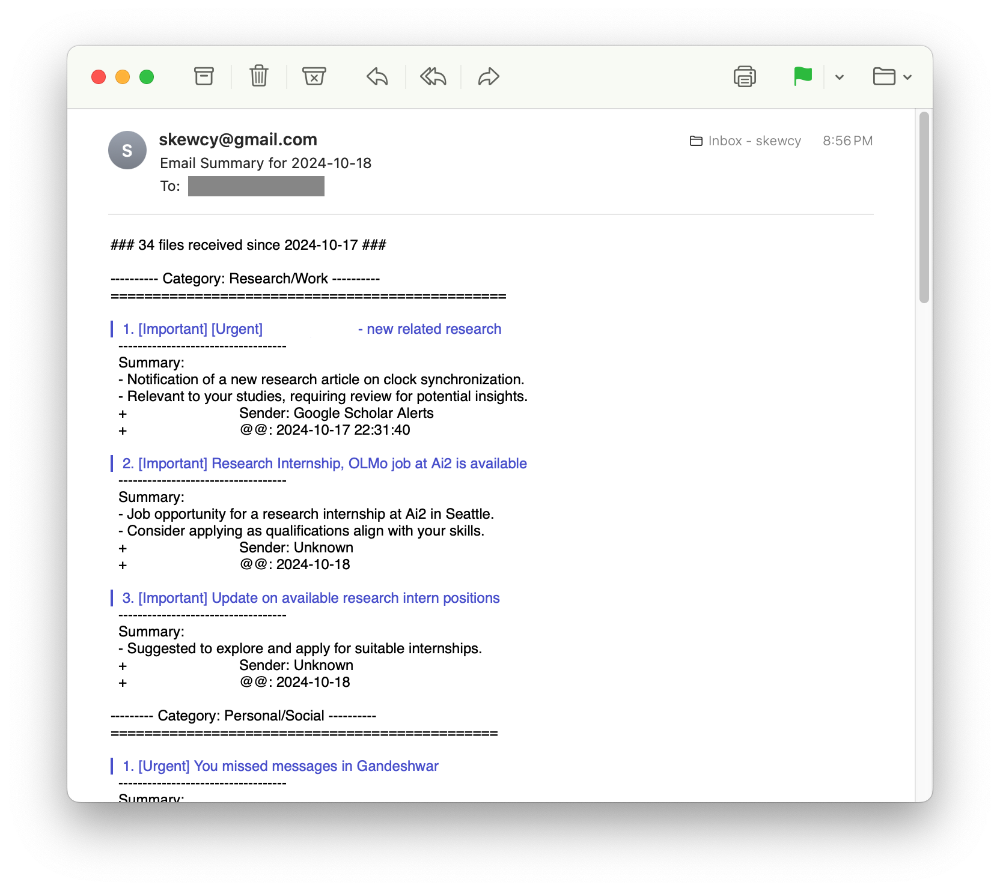

# 1mail

Automated daily email summarization based on Github Actions and OpenAI API

## Usage

1. Fork this repository
2. Add secret variables to your repository

## Set secret variables 

First make sure Github __Actions are enabled__ in your forked repository. Then go to your repo settings, tab __Secrets and variables__ -> Actions -> New repository secret and add the following variables:

- `GMAIL_USER`: Your email address (e.g. `yourname@gmail.com`)
- `GMAIL_PASSWORD`: Your gmail __app-specific password__
- `OPENAI_API_KEY`: Your OpenAI API key
- `RECIPIENT_EMAIL`: The email address where you want to receive summaries

If you use Gmail, you can generate an app-specific password for your account via this [link](https://myaccount.google.com/apppasswords).

## Example result

